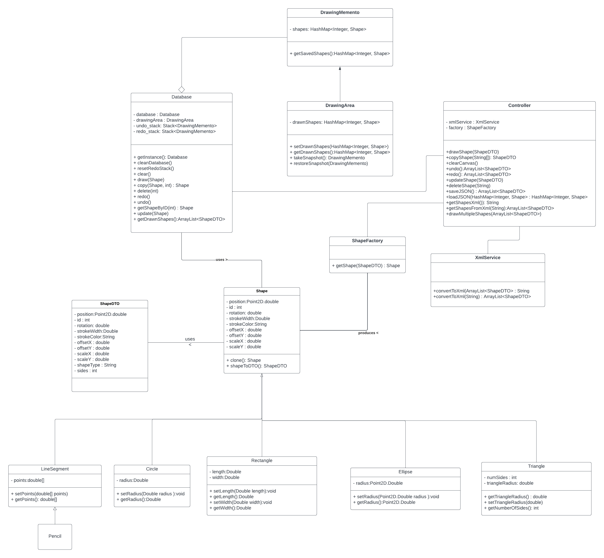

# Lab 2: Paint Application

- OOP and Design Patterns Course Assignment
- [/PaintApp: Github Respository Link](https://github.com/ahmedyoussefg/PaintApp)

Team Members:

| Name | ID |
| --- | --- |
| Ahmed Youssef Sobhy Elgoerany | 21010217 |
| Ahmed Mustafa Elmorsy Amer | 21010189 |
| Ali Hassan Ali Mohamed | 21010837 |
| Moustafa Esam El-Sayed Amer  | 21011364 |

---

## 1 **Introduction**

The Paint Application is a feature-rich drawing and painting tool designed for creative expression and design. Developed with VueJS for the frontend and Spring Boot for the backend, the application leverages RESTful APIs to facilitate communication between the two layers.

## **2 Object-Oriented Model for Geometric Shapes**

### **2.1 Design Overview**

The object-oriented model encapsulates various geometric shapes, fostering a hierarchy that includes Line Segment, Circle, Ellipse, Triangle, Rectangle, and Square. The model's robustness is underpinned by the effective application of inheritance and polymorphism.

### **2.2 UML Class Diagram**

The UML class diagram visually represents the structure of the object-oriented model, meticulously detailing the classes, attributes, and methods. Inheritance relationships and polymorphism are prominently featured, showcasing the elegance of the design.



## **3 Application Features**

### **3.1 Drawing and Painting Functionalities**

The GUI of the application boasts an extensive array of functionalities for users:

- **Draw:** Users can sketch free-form lines or choose from predefined shapes like ellipse, triangle, rectangle, square, circle and others.
- **Color:** Shapes can be filled with various colors from a color gradient, enhancing the visual appeal of the canvas.
- **Resize and Scale:** Shapes are easily adjustable, offering users flexibility in dimension control.
- **Move:** The cursor facilitates precise positioning of shapes, ensuring accuracy in parameter adjustments.
- **Copy:** The application seamlessly implements the Prototype Design Pattern for effortless shape duplication.’
- **Focus on the shape:**  Upon hovering on a shape, the shape is put on focus by changing the colours and adding shadows.
- **Delete:** Entire shapes or free-form drawings can be removed from the canvas.
- **Undo and Redo:** Leveraging the Memento Design Pattern, users can navigate through a history of canvas states, undoing or redoing actions.
- **Clear Canvas:** The entire canvas can be cleared, with the option to undo this action.
- **Save and Load:** Drawing files can be saved in both XML and JSON formats, and users can reload previous files, with undo/redo history persistence.

### **3.2 User-Friendly Interface**

The GUI is designed with a focus on intuitiveness and user-friendliness. Functionality is easily accessible through the interface, providing a seamless user experience.

[PHOTOS OF UI] PUT HERE

## **4 Backend Design Patterns**

1. **Shape Factory Design Pattern**
    - The Shape Factory Design Pattern dynamically generates various geometric shapes, offering a flexible and extensible approach to shape creation.
2.  **Prototype Design Pattern**
    - Efficient copying of shapes is achieved through the application of the Prototype Design Pattern, simplifying the creation of new shapes based on existing ones.
3.  **Memento Design Pattern**
    - The Memento Design Pattern manages the undo and redo functionality, capturing and storing snapshots of the canvas state in stacks for easy restoration.
4.  **Singleton Design Pattern**
    - The Singleton Design Pattern ensures a single, centralized database instance, managing the current drawn shapes, undo stack, and redo stack. This design choice optimizes resource utilization and prevents unnecessary duplication.

## 5 Implementation Details

1. **RESTful API Endpoints:**
    - **`/draw` (POST):** Accepts a JSON request containing shape data, creates a new shape using a factory, and stores it in the database.
    - **`/copy` (POST):** Accepts an array of strings containing shape IDs for copying, retrieves the specified shape from the database, clones it, and stores the copy in the database.
    - **`/clear` (GET):** Clears the entire canvas by removing all shapes from the database and putting an empty snapshot in the undo stack.
    - **`/undo` (POST):** Undoes the last action by reverting the state of the database to the previous state.
    - **`/redo` (POST):** Redoes the last undone action by reverting the state of the database to the next state.
    - **`/update` (POST):** Accepts shape data, creates a new shape using a factory, and updates the corresponding shape in the database.
    - **`/delete` (POST):** Accepts the ID of a shape to be deleted and removes it from the database.
    - **`/saveJSON` (POST):** Retrieves all shapes from the database and returns their data in JSON format.
    - **`/saveXML` (GET):** Retrieves all shapes from the database and returns their data in XML format.
    - **`/loadXML` (POST):** Accepts XML data, cleans the database, parses the XML to obtain shape data, and draws the shapes on the canvas.
    - **`/clean` (GET):** Cleans the database by removing all shapes from the database.
2. **Shape Management:**
    - Shapes are represented using a **`Shape`** class, and their data is transferred between the client and server using **`ShapeDTO`** (Data Transfer Object).
    - Shapes are created and manipulated using a **`ShapeFactory`** class.
    - The **`Database`** class is responsible for storing and managing the drawn shapes.
3. **XML Serialization and Deserialization:**
    - The **`XmlService`** class is used to convert a list of shape DTOs to XML format (**`getShapesXml`**) and vice versa (**`getShapesFromXml`**).
        1. **Service Annotation:**
            - The **`@Service`** annotation indicates that this class is a service component and is eligible for Spring's auto-detection and wiring.
        2. **XML Conversion Methods:**
            - **`convertToXml` Method:**
                - Takes an **`ArrayList<ShapeDTO>`** as input.
                - Uses the **`XmlMapper`** from the Jackson library to convert the list of **`ShapeDTO`** objects to an XML string.
                - Throws **`JsonProcessingException`** if an error occurs during the XML conversion.
            - **`convertXmlToShapes` Method:**
                - Takes an XML string as input.
                - Uses the **`XmlMapper`** to convert the XML string back into an **`ArrayList<ShapeDTO>`** using the **`TypeReference`** class.
                - Throws **`IOException`** if an error occurs during the XML deserialization.
4. **Cross-Origin Resource Sharing (CORS):**
    - CORS is enabled to allow requests from a specific frontend origin (**`http://localhost:8080`**).
5. This Java class **`Database`** serves as a repository for managing the state of drawn shapes in a collaborative drawing application. Let's break down some of its functionalities:
    1. **Singleton Design Pattern:**
        - The class follows the Singleton pattern, ensuring that only one instance of the **`Database`** is created, providing a global point of access to its functionality.
    2. **DTO Conversion:**
        - **`getDrawnShapesDTOs`** converts the drawn shapes into a list of **`ShapeDTO`** objects for transmission to the frontend.
6. The **`ShapeFactory`** class acts uses **Factory Design Pattern** for creating instances of different shapes, promoting flexibility and encapsulation by centralizing the creation logic based on the type of shape specified in the **`ShapeDTO`** data.
7. **`DrawingArea`** class serves as a container for managing the state of drawn shapes in your application. The Memento pattern is employed to capture and restore the state, allowing for actions like undo and redo in a drawing context.
    - **`DrawingArea` as Originator:**
        - The **`DrawingArea`** class encapsulates the state of drawn shapes.
        - It provides a **`takeSnapshot`** method to create a Memento (snapshot) of its current state.
    - **`DrawingMemento` as Memento:**
        - This inner class represents a snapshot of the **`DrawingArea`**'s state.
        - It stores a copy of the **`drawnShapes`** state when created.
    - **`undo_stack` and `redo_stack` as Caretaker:**
        - The stacks manage the different states of the **`DrawingArea`** (Originator).
        - The **`undo`** and **`redo`** operations involve popping Mementos from one stack and pushing them onto the other.
8. **Debugging Functionality:**
    - The **`DEBUG`** method is used for debugging purposes, printing information about saved shapes, including their data.

---

## 6 **Conclusion**

The Paint Application harmoniously combines a well-designed object-oriented model with advanced drawing and painting features. The backend design patterns enhance the application's flexibility, maintainability, and overall user experience. With its intuitive interface and comprehensive functionality set, the application stands as a powerful tool for creative expression.

## 7 **Instructions for Running the Code**

### **Prerequisites**

- Ensure Java and Node.js are installed on your system.
- Clone the GitHub repository:
    
    ```bash
    git clone https://github.com/ahmedyoussefg/PaintApp.git
    ```
    

### **Backend (Spring Boot)**

1. Open the backend project in your preferred IDE.
2. Run the Spring Boot application to start the backend server.

### **Frontend (VueJS)**

1. Run the following commands:
    
    ```bash
    npm install
    npm run serve
    ```
    
2. Access the application in your web browser at the provided URL.

## 8 User How-To Guide

[VIDEO OF USING THE WEB APPLICATION]